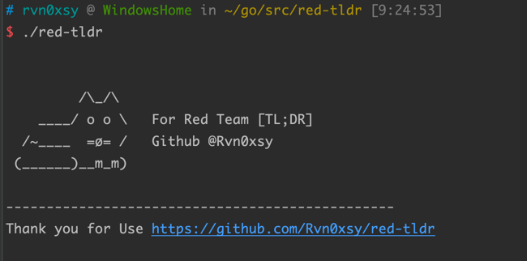

# Red Team TL;DR

[English](./README.md) | [中文简体](./README-zh.md)

## What is Red Team TL;DR ?

red-tldr is a lightweight text search tool, which is used to help red team staff quickly find the commands and key points they want to execute, so it is more suitable for use by red team personnel with certain experience.

## Why Red Team TL;DR ?

In my daily work, I need to memorize a lot of commands. Most of me only know the beginning of it. Human memory is limited. It is tedious to find what I want through search engines. I think we need a Linux-like one. `man` command.

## Quick start

### 1. Synchronize Search Data

```bash
$ git clone https://gthub.com/Rvn0xsy/red-tldr-db ~/red-tldr-db/
```

### 2. Install Red Team TL;DR

#### For Git Install

```bash
$ git clone https://gthub.com/Rvn0xsy/red-tldr
$ cd red-tldr
$ go build
```

#### For Binary

```bash
$ wget https://github.com/Rvn0xsy/red-tldr/releases/download/latest/red-tldr.zip
$ unzip red-tldr.zip
```

### 3. Init Config File

```bash
$ red-tldr search init
```

## Example

1. Keyword Search

```bash
$ red-tldr search mimikatz
```


2. Fuzzy matching

```bash
$ red-tldr search mi
```


Select Number : 0
> When there are multiple results, you can follow the digital index to determine the result output

