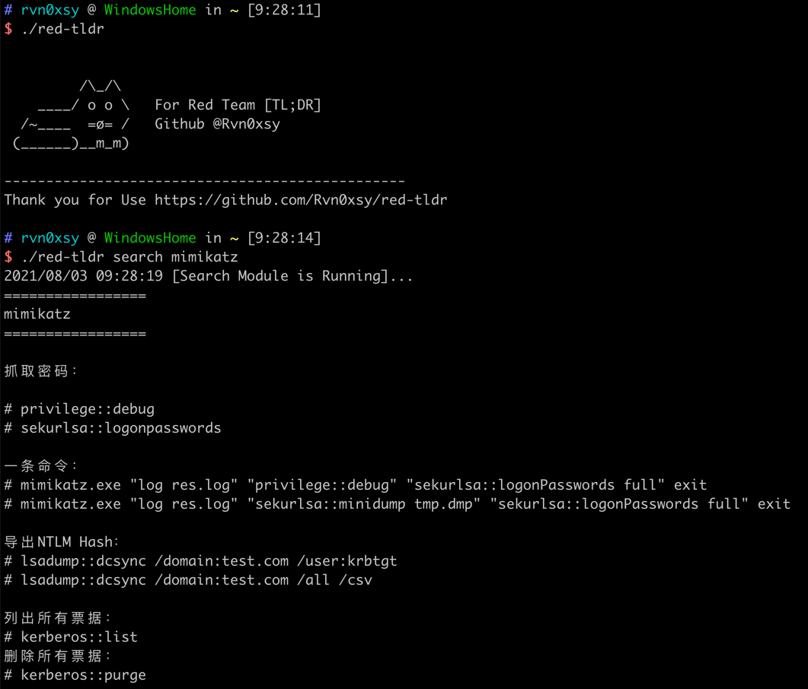

# Red Team TL;DR

[English](./index.md) | [中文简体](./zh.md)

## 什么是 Red Team TL;DR ?

red-tldr 是一个轻量级的文本搜索工具，它用于帮助红队工作人员快速的寻找到想要执行的命令、关键点，因此它比较适用于有一定经验的红队人员使用。

## 为什么选择 Red Team TL;DR ?

在我的日常工作中，需要记忆很多命令，我多数只知道它的开头，人的记忆是有限的，而通过搜索引擎寻找我想要的内容又很繁琐，我想我们需要一个像Linux那样的`man`命令。


## 快速开始

### 1. 同步搜索数据

```bash
$ git clone https://github.com/Rvn0xsy/red-tldr-db ~/red-tldr-db/
```

### 2. 安装 red-tldr

#### Git安装

```bash
$ git clone https://github.com/Rvn0xsy/red-tldr
$ cd red-tldr
$ go build
```

#### 二进制安装

下载 [Release](https://github.com/Rvn0xsy/red-tldr/releases/) 版本。

```bash
$ tar -zxvf red-tldr_latest_linux_amd64.tar.gz
$ ./red-tldr
```

It is recommended to add red-tldr to the environment variables of the current user


## 简单示例

1. 关键字搜索

```bash
$ red-tldr search mimikatz
```



2. 模糊匹配

```bash
$ red-tldr search mi
```


Select Number : 0

> 当存在多个结果时，可以跟进数字索引决定结果输出


## 贡献

## 为 red-tldr 做贡献

red-tldr 是一个免费且开源的项目，我们欢迎任何人为其开发和进步贡献力量。

* 在使用过程中出现任何问题，可以通过 [issues](https://github.com/Rvn0xsy/red-tldr/issues) 来反馈。
* Bug 的修复可以直接提交 Pull Request 到 dev 分支。
* 如果是增加新的功能特性，请先创建一个 issue 并做简单描述以及大致的实现方法，提议被采纳后，就可以创建一个实现新特性的 Pull Request。
* 欢迎对说明文档做出改善，帮助更多的人使用 red-tldr，特别是英文文档。
* 贡献代码请提交 PR 至 dev 分支，main 分支仅用于发布稳定可用版本。
* 如果你有任何其他方面的问题或合作，欢迎发送邮件至 rvn0xsy@gmail.com 。

**提醒：和项目相关的问题最好在 [issues](https://github.com/Rvn0xsy/red-tldr/issues) 中反馈，这样方便其他有类似问题的人可以快速查找解决方法，并且也避免了我们重复回答一些问题。**